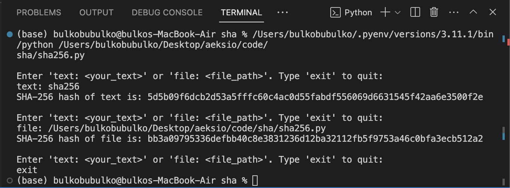

# SHA-256

## What is SHA-256?
SHA-256 is a cryptographic hash function. It maps arbitrary strings of data to fixed length output (256-bit hash value) in deterministic, public, ‘random’ manner. It is a one-way function, meaning that it is not possible to get the input from the output. It is also collision resistant, meaning that it is not possible to find two inputs that give the same output.

## How does SHA-256 work?

To understand how SHA-256 works, we need to understand the following concepts:

Operation (done on 32-bit chunks):
1) Shift right. Shifts the bits to the right.
2) Rotation right. Circular right shift. 
3) XOR. If the bits are the same, the result is 0. If the bits are different, the result is 1.
4) Addition. Adds the bits together. After we take mod 2**32 for the length to be within 32-bit. 

Functions:
1) sigma0: ROTR7 -> ROTR 18 -> SHR3 and XOR them together. 
2) sigma1: ROTR17 -> ROTR 19 -> SHR10 and XOR them together. 
3) Sigma0: ROTR2 -> ROTR 13 -> ROTR22 and XOR them together. 
4) Sigma1: ROTR6 -> ROTR 11 -> ROTR25 and XOR them together. 
5) Choice: Considers 3 32-bit chunks. Takes the first chunk to determine whether to take the second or the third. If it’s 1 it takes second input, if 0 takes third.
6) Majority: takes the majority of three bits. (110-> 1 100->0)

Constants: 
1) K: 64 constants. The first 32 bits of the fractional parts of the cube roots of the first 64 primes.
2) H: 8 constants. The first 32 bits of the fractional parts of the square roots of the first 8 primes.

How it works:
1) Take the input (text, file, etc.)
2) Convert the input to binary representation.
3) Padding: 

    Add a 1 to the end of the input (binary represenation). Then we need to add zeros until the length of the input is 512-64=448 bits. Then we add the length of the input in binary representation, this should of of lenth 64. So that the length of the input is a multiple of 512 bits.
4) Break the input into 512-bit chunks to create blocks.
5) Message schedule: 

    Break the 512-bit chunks into 16 32-bit chunks to create words.
    
    Extend the 16 32-bit chunks into 64 32-bit chunks. Using the following formula: 

    ```sigma1(t-2) + (t-7) + sigma0(t-15) + (t-16)```

6) Compression:
    
    Initialize the hash values (H) and the round constants (K).
    
    Create temporary word using the following formula:

    ```T1 = Sigma1(e) + Choice(e, f, g) + h + K0 + W0```

    ```T2 = Sigma(a) + Majority(a, b, c)```

    *Note: here a, b, c, d, e, f, g, h are the hash values h[0], h[1], h[2], h[3], h[4], h[5], h[6], h[7] respectively. W0 is the first word in the message schedule. K0 is the first constant in the round constants.*

    Move the hash values down one.  So that we loose the last one and leave space inside a. Set a to T1+T2, and add T1 to e. 

    Repeat steps 8 and 9 for every single word in the message schedule.

    Get the initial hash values we started with (a-h) and add on the end results of the compression.

7) Repeat the process for every single message block. Where the initaial values are the end values of the previous block.
8) Convert it to hexadecimal representation.

All done!

## Additional Resources

[NIST FIPS 180-4 Standard](https://nvlpubs.nist.gov/nistpubs/FIPS/NIST.FIPS.180-4.pdf): Official document defining the SHA-256 standard.

[How Does SHA-256 Work?](https://www.youtube.com/watch?v=f9EbD6iY9zI): GOAT video explaining SHA-256.

[karpathy/cryptos](https://github.com/karpathy/cryptos): Andrew Karpathy's implementation of Bitcoin.

## Usage

1) Execute the script by running the following command in your terminal or command prompt:

   ```bash
   python sha256.py
    ```

## Example
